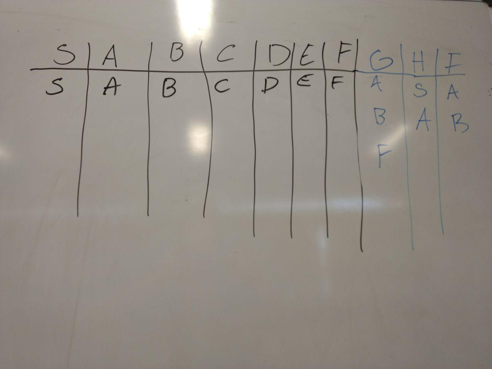

# Algoritmo para determinização do autômato

<table>
  <thead>
    <tr>
      <th>Passo:</th>
      <th>Ação</th>
    </tr>
  </thead>
  <tbody>
    <tr>
      <td>1</td>
      <td>Criar uma tabela com os estados existentes antes da determinização. Inicialmente, cada estado mapeia para si mesmo, pois só possui a si mesmo em sua composição.  
      Exemplo: S -> S, A -> A.  
      Por que? Imagine uma situação em que a determinização do estado [AB] por "a" leve para <̱S>, precisamos saber se S possui em sua transição por "a" uma composição. Se sim, devemos pegar os estados para quais S transiciona na tabela. Caso contrário, devemos pegar os estados presentes na transição de S por "a". </td>
    </tr>
    <tr>
      <td>2</td>
      <td>Identificar um estado que contenha um indeterminismo.</td>
    </tr>
    <tr>
      <td>3</td>
      <td>Ordenar a transição indeterministica, em ordem crescente de acordo com os índices.</td>
    </tr>
    <tr>
      <td>4</td>
      <td>Procurar se aqueles estados já não foram associados a um novo estado na tabela de determinização.
        Exemplo: se no estado anterior tínhamos o indeterminismo {A, B} e nesse também temos o indeterminismo {A, B}, certamente ele já está na tabela, basta procurar por ele.</td>
    </tr>
    <tr>
      <td>5</td>
      <td>Caso seja necessário criar um novo estado para o indeterminismo sendo tratado, devemos prosseguir para a composição e determinização do estado criado, num passo recursivo. Isso acontece até que não surjam mais indeterminismos. </td>
    </tr>
    <tr>
      <td>6</td>
      <td>Trocar o indeterminismo pelo novo estado gerado.</td>
    </tr>
    <tr>
      <td>7</td>
      <td>Eliminar estados inalcançáveis a partir de S novamente, pois provavelmente surgirão novos.
      Exemplo: figura 1.</td>
    </tr>
  </tbody>
</table>

<figure>
  

  <figcaption>Figura 1 - Determinização do AFND. O estado A (em vermelho) é inalcançável a partir de S (o B está erroneamente vermelho).</figcaption>
</figure>

<figure>
  

  <figcaption>Figura 2 - Um autômato depois do processo de determinização.</figcaption>
</figure>

<figure>
  

  <figcaption>Figura 3 - Tabela de mapeamento (do autômato acima) dos estados depois do processo de determinização. </figcaption>
</figure>
